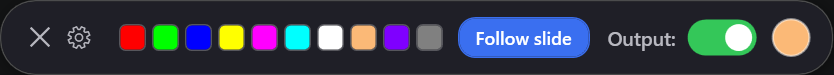
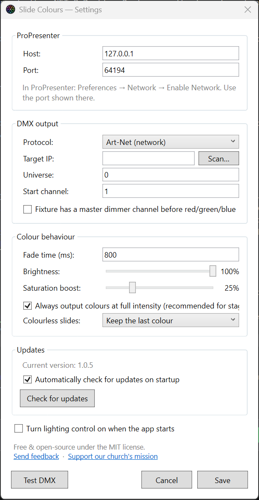

# Slide Colours

Matches your stage lighting to what's on screen. Slide Colours watches ProPresenter on the
local machine, extracts the dominant colour of each slide as it goes live, and streams that
colour to your DMX rig — with a small floating on/off toggle you can park anywhere on screen.
It also doubles as a dead-simple standalone DMX colour controller when you're not driving it
from ProPresenter at all (see [Using it as a plain DMX controller](#using-it-as-a-plain-dmx-controller)).

<p align="center">
  
</p>

## Download

**[⬇ Download the latest release](https://github.com/tango7nz/slide-colours/releases/latest)** —
grab `SlideColours.exe` and double-click it. It's fully self-contained, so there's
**nothing to install** (no .NET runtime needed) — just 64-bit Windows 10/11.

> On first launch, Windows SmartScreen may warn about an unrecognised app (the exe is unsigned).
> Click **More info → Run anyway**.

## How it works

1. Listens to ProPresenter's local HTTP API for slide changes (streaming, no polling).
2. When the slide changes, fetches that slide's thumbnail and finds its dominant colour —
   biased towards vivid, saturated pixels so white lyric text and black backgrounds are ignored.
3. Fades the stage colour smoothly to the new colour and transmits DMX ~30×/second while
   the toggle is on. When toggled off, it stops transmitting so your lighting desk is back in charge.

## Requirements

- Windows 10/11 (64-bit). The [downloadable release](#download) is self-contained and needs
  nothing else installed. (Building it yourself framework-dependent instead needs the **.NET 8
  Desktop Runtime** — see [Building from source](#building-from-source).)
- **ProPresenter 7.9 or later** with the network API enabled:
  *ProPresenter → Preferences → Network → tick **Enable Network***, then note the **port** shown there.
- A DMX route, one of:
  - **Art-Net** node/gateway on the network (default)
  - **sACN (E1.31)** node on the network
  - **Enttec DMX USB Pro** (or compatible) on a COM port

## Running it

Launch **SlideColours** (the exe you downloaded). A small floating pill appears (top-right by
default). From left to right:

- **✕ Close** — quits the app.
- **Cog** — opens *Settings…*.
- **Favourite colours** — ten preset swatches:
  - **Left-click** to send that colour to the lights (this switches to *manual* mode — see below).
  - **Right-click** to edit that swatch: a colour picker opens seeded with its current colour, and
    saving stores the new colour in that slot.
- **Follow slide** — the colour mode. When highlighted (blue), the stage colour tracks the live
  slide. Picking a favourite (or a manual colour) holds that colour and dims this button; click it
  again to go back to following the slide. It's **greyed out when ProPresenter isn't connected**
  (hover it to see why) — that's also your connection indicator.
- **Output:** toggle — turns stage-lighting control on/off. This is the only control you need
  mid-service.
- **Colour circle** (far right) — shows the colour currently being sent (dimmed while off).

**Drag** any empty part of the pill to move it; the position is remembered (and kept on-screen).

### Colour modes

- **Follow slide** (default) — the stage colour is extracted from each live slide.
- **Manual** — left-clicking a favourite, or saving a colour from the picker, holds that exact
  colour and ignores slide changes until you press **Follow slide** again.

## Using it as a plain DMX controller

You don't need ProPresenter at all. Manual colour control talks straight to your DMX rig, so the
app works on its own as a tiny always-on-top colour controller — handy for a static wash, quick
colour checks, or venues that don't run ProPresenter:

- Point it at your fixture once in **Settings** (protocol, universe, start channel — same as below).
- **Left-click a favourite** to send that colour, or **right-click** one to pick any colour you like.
  These drive the lights immediately; there's no slide involved.
- Flip the **Output** toggle on to transmit, off to hand control back to your desk.

The only thing that needs ProPresenter is the **Follow slide** button — it stays greyed out when
ProPresenter isn't connected, but everything else keeps working. So you can install it purely as a
set-and-forget RGB controller and never enable the network API.

## First-time setup

Click the **cog** → **Settings…**

<p align="center">
  
</p>

| Setting | Notes |
|---|---|
| ProPresenter host/port | Usually `127.0.0.1` and the port from Preferences → Network |
| Protocol | Art-Net, sACN, or Enttec USB Pro |
| Target IP | Blank = broadcast (Art-Net) / multicast (sACN). Click **Scan…** to search the network (Art-Net discovery) and pick your node from a list |
| Universe | Art-Net counts from 0, sACN counts from 1 |
| Start channel | First channel of your RGB fixture (1–512). Layout is R, G, B — or Dimmer, R, G, B if you tick the master-dimmer box |
| Fade time | How long colour changes take (ms) |
| Brightness | Master intensity of the output |
| Saturation boost | Makes washed-out slide colours punchier on stage |
| Full intensity | Always drive lights at full brightness regardless of how dark the slide is (recommended) |
| Colourless slides | What to do for black/white slides: keep last colour (default), fade off, or warm white |

Then hit **Test DMX** (bottom-left of the Settings window) — the lights should run a rainbow sweep.
If they do, you're patched correctly.

## Good to know

- Colours come from the **slide thumbnail**. If your lyric slides are transparent text with the
  motion background triggered on ProPresenter's *media layer*, the slide itself has no colour —
  the "colourless slides" fallback rule applies. Slides/looks with built-in backgrounds work best.
- When toggled **off**, the app stops sending DMX entirely (it doesn't send blackout), so a
  console merging via HTP/LTP will simply take back control.
- Settings and your ten favourite colours live in `%APPDATA%\SlideColours\settings.json`.

## Deploying to another PC

For almost everyone this just means: **download the self-contained exe from the
[latest release](https://github.com/tango7nz/slide-colours/releases/latest) and copy that one file
across.** It bundles the .NET 8 runtime, so it runs on a bare, clean Windows 10/11 with **nothing
preinstalled** — ideal for a shared or locked-down machine like a church booth PC. To update it,
replace the file with a newer release.

Prefer a tiny (~1 MB) download instead? Build the *framework-dependent* variant yourself (see
[Building from source](#building-from-source)). It needs the
[.NET 8 Desktop Runtime (x64)](https://dotnet.microsoft.com/download/dotnet/8.0) installed on the
target machine — Windows ships only the unrelated .NET Framework 4.8 — but then stays patched via
Windows Update.

## Building from source

Framework-dependent (small, needs the .NET 8 Desktop Runtime on the target machine):

```powershell
dotnet publish SlideColours\SlideColours.csproj -c Release -r win-x64 --self-contained false /p:PublishSingleFile=true -o dist
```

Fully self-contained single file (runs anywhere, no runtime install needed):

```powershell
dotnet publish SlideColours\SlideColours.csproj -c Release -r win-x64 --self-contained true /p:PublishSingleFile=true /p:IncludeNativeLibrariesForSelfExtract=true /p:DebugType=none -o dist-standalone
```

## Feedback

Slide Colours is free for anyone to use — churches, venues, hobbyists, whoever finds it useful.
If you *do* use it, I'd genuinely love to hear about it: what you're running it on, how it's
working out, or anything you'd like it to do. There's no obligation at all — just drop me a line
at **[hughburns@outlook.co.nz](mailto:hughburns@outlook.co.nz)**. Bug reports and ideas are also
welcome via [GitHub issues](https://github.com/tango7nz/slide-colours/issues).

## Support this project

Slide Colours is free, and always will be. If you find it useful and would like to give something
back, you're welcome to make a small donation towards our church's mission:
**<https://lifechurch.nz/church-life/#giving>**. It's entirely optional and there's no catch —
just a thank-you if you've found it useful.

## License

Released under the [MIT License](LICENSE) — free to use, modify, and share, including
commercially, with no warranty. © 2026 Hugh Burns.
